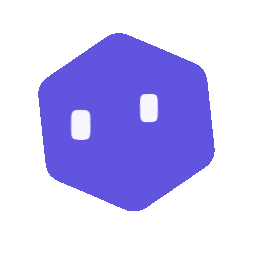

  

# Noyau

Noyau is an ADE "Agentic Development Environment". It enables control of the agents on your machine with a best-in-class [Electron-based desktop app](https://noyau.hezaerd.com).

> [!IMPORTANT]
> Noyau is currently in ultra-early development. The API and desktop app are subject to change.
> 
> Please report any issues you encounter or feature requests you have via [GitHub Issues](https://github.com/hezaerd/noyau/issues).

### Installation

> [!NOTE]
> Noyau currently supports Codex, Claude Code and Cursor. Install and authenticate at least one provider before using Noyau.
>
> - Codex: install [Codex CLI](https://developers.openai.com/codex/cli) and run `codex login`
> - Claude Code: install [Claude Code](https://claude.com/product/claude-code) and run `claude auth login`
> - Cursor: install [Cursor](https://cursor.com/cli) and run `agent login`

#### Desktop App

The desktop app is available for Windows and macOS. Install the latest version from [GitHub Releases](https://github.com/hezaerd/noyau/releases).

## Roadmap

- [ ] Add support for more agent harnesses (OpenCode, Gemini (Antigravity), Hermes, Pi, etc.)
- [ ] Stabilize the API and desktop app
- [ ] Linux support
- [ ] Browser tool + terminal
- [ ] Pull request viewer + diff viewer
- [ ] Headless (CLI `noyau serv`) + remote connection (SSH, Tailscale)
- [ ] Automations (scheduled tasks, n8n integration)
- [ ] Collaboration features (shared workspaces, team chat, etc.)

## Contributing

Read the [contributing guidelines](CONTRIBUTING.md) before opening an issue or a PR.

## License

Noyau is licensed under the [MIT License](LICENSE).
